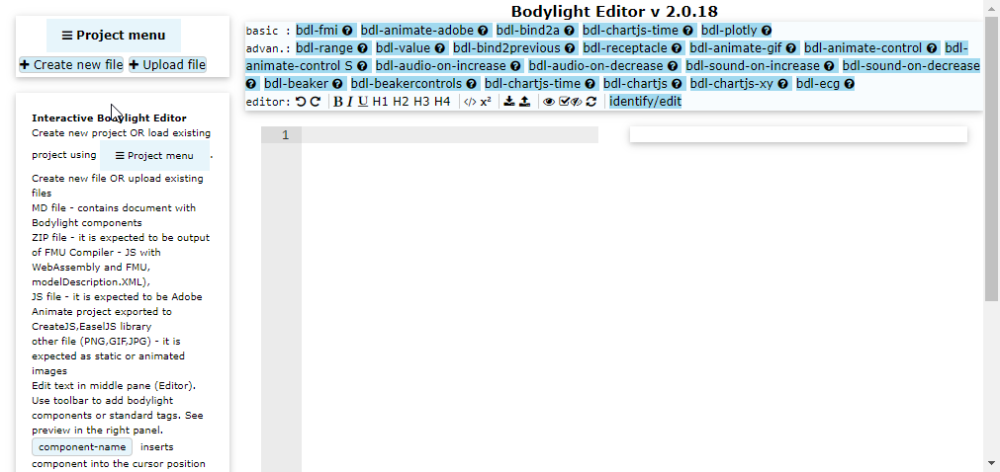
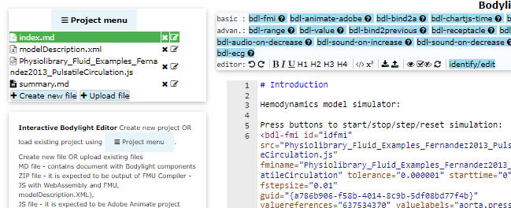

# Advanced Editor {num=11}

In this step we will open existing project created in Basic Tutorial and create a new empty page.

## Open Bodylight-Editor 

1. either from local installation of Bodylight-VirtualMachine at http://localhost:8080/editor/
2. or from public static web page at https://bodylight.physiome.cz/Bodylight-Editor/




## Open project ZIP file

If the editor already contains project created in Basic Tutorial, you may skip this step. Otherwise click <button>Project Menu</button> and <button>Load project from ZIP</button> and select ZIP file containing the project. 

You should see the basic project files:




## Create a new file

Click <button><i class="fa fa-plus"></i> Create new file</button> and enter name 'animation.md'.

A sample content is filled in the new file.

## Add link to summary

Click on `summary.md` file in the left project list panel and add a row linking to the `animation.md` file. So it may look like:
```markdown
  * [Introduction](#index.md)
  * [Animation](#animation.md)
```

Do not forget the hash sign `#` before `animation.md` in parenthesis.
