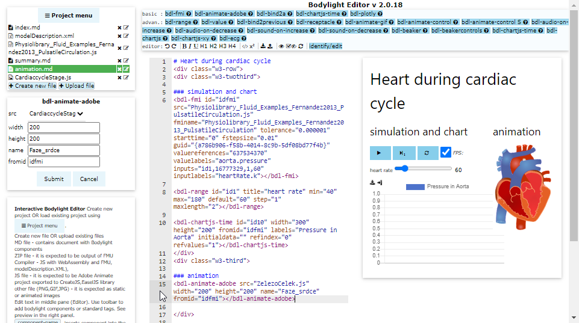

# 13. Animation
In this section we will import animation object created in Adobe Animate and exported as `Create.js` object.

## Prepare or download sample animation object

Before uploading the Adobe Animate object file - please download the sample from this link <a href="CardiaccycleStage.js" download>CardiaccycleStage.js</a>

This animation object was created in Adobe Animate and exported as Javascript using CreateJS API.

## Upload the animation object

Click <button><i class="fa fa-plus"></i> Upload file</button> and select the `CardiaccycleStage.js` file downloaded in previous step.

## Animate-Adobe component

click on <button>bdl-animate-adobe</button> and a dialog with this component will appear.

Ensure that the `src` attribute is automatically set to `CardiaccycleStage.js` file

Fill the following attributes:
* width: `200`
* height: `200`
* name: `Faze_srdce`
* fromid: `idfmi`

Note that _name_ attribute is important to address the object inside the object.

## add animate component into the document

Click on editor and move cursor bellow the line `### animation`.

Then click <button>Submit</button> button and a component definition will appear at the cursor position in editor.

If all goes well, the animation should render at the right part of the preview panel.

