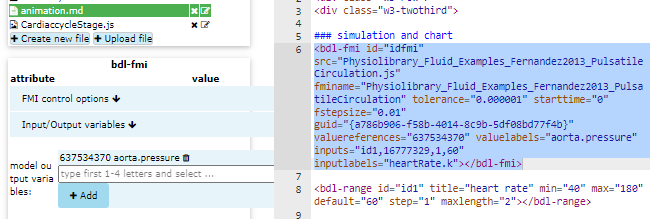
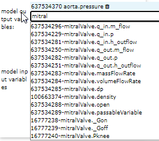
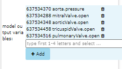

# 14. Advanced - Add Output Variables

In this section we will add variables to be retrieved from model simulation.

From previous section you should have 
* working simulation with chart in left part
* animation object that renders in right part

## Pickup valve state from model

First we need to pickup the valve state variable from model.

Go to editor and place cursor inside the `<bdl-fmi></bdl-fmi>` element and click <button>identify/edit</button>.

This will identify the attributes of fmi component and shows dialog.

## Select mitral valve variable

In the output variable input field start typing: `mitral`

If you see list of available variables click on `mitralValve.open` and
click <button><i class="fa fa-plus"></i> Add</button> button.

## Select other valves

Using the same procedure find and add the other variables:
* `aorticValve.open`
* `tricuspidValve.open`
* `pulmonaryValve.open`

After you added all these variables you should see the list:
    

## Submit fmi component
Click <button>Submit</button> button. This will replace existing `<bdl-fmi></bdl-fmi>` component definition with the new one.

