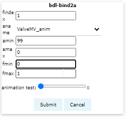
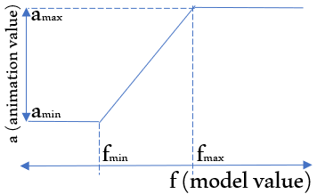

# 15. Advanced - Bind animation

In this section we will bind the model output variables with animation objects

## Add bdl-bind2a

Move cursor line after <span class="w3-green">`<bdl-animate-adobe></bdl-animate-adobe>`</span> and click <button>bdl-bind2a</button>.

## bind mitral valve animation

Set these options
* findex: `1` - this is index of `mitralvalve.open` variable in fmi output array.
* aname: `ValveMV_anim` - select this among available animation objects
* amin: `99` - this is position when the mitral valve is closed
* amax: `0` - this is position when the mitral valve is open
* fmin: `0` - this is value of model variable for closed valve
* fmax: `1` - this is value of model variable for opened valve
 


Note that value from model simulation between `fmin` and `fmax` is linearry converted to values between `amin` and `amax` as in following draft:



## Test animation object

Within the slider `animation test` you may check the animation position and it's corresponding `amin`,`amax` values. You may select '0', '50','99','100' this shows open, half open, closed and open position. The 100 value overflows the alowed value thus default animation position is showed - which is '0'.

## Submit binding

Click <button>Submit</button> button. This will add binding between model and animation. 

You may check whether animation is reflected during simulation by pressing <button><i class="fa fa-play"></i></button> button to start. Stop the simulation after checking. The mitral valve animation opens and closes based on the value retrieved from model.

## bind other valves

### aortic valve

Reuse the bdl-bind2a dialog and set these options:

* findex: `2`
* aname: `ValveOAV_anim`
* amin: `0`
* amax: `99`
* fmin: `0`
* fmax: `1`

Click <button>Submit</button> button.

### tricuspid valve

Reuse the bdl-bind2a dialog and set these options:

* findex: `3`
* aname: `ValveTV_anim`
* amin: `99`
* amax: `0`
* fmin: `0`
* fmax: `1`

Click <button>Submit</button> button.

### pulmonary valve

Reuse the bdl-bind2a dialog and set these options:

* findex: `4`
* aname: `ValvePV_anim`
* amin: `0`
* amax: `99`
* fmin: `0`
* fmax: `1`

Click <button>Submit</button> button.

## All valves animated

Now your editor should contain this binding components:
```markdown
<bdl-bind2a findex="1" aname="ValveMV_anim" amin="99" amax="0" fmin="0" fmax="1"></bdl-bind2a>
<bdl-bind2a findex="2" aname="ValveAOV_anim" amin="0" amax="99" fmin="0" fmax="1"></bdl-bind2a>
<bdl-bind2a findex="3" aname="ValveTV_anim" amin="99" amax="0" fmin="0" fmax="1"></bdl-bind2a>
<bdl-bind2a findex="4" aname="ValvePV_anim" amin="0" amax="99" fmin="0" fmax="1"></bdl-bind2a>
```

If you play the simulation in preview panel by <button><i class="fa fa-play"></i></button> button you should see all valves to be animated.


