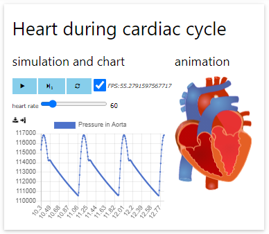

# 16. Advanced - Volume Animation

In this section we will bind model variable with volume information to animation of volume in the heart image.

## Pick volume variable

In the editor panel, move cursor into `<bdl-fmi></bdl-fmi>` component and click <button>identify/edit</button>.

In the __bdl-fmi__ dialog -> model output variables, type `volume` and select
* `leftVentricle.volume` and click <button>Add</button>
 
Type again `volume` and select
* `rightVentricle.volume` and click <button>Add</button>

Click <button>Submit</button> and your `<bdl-fmi>` component is now updated.

## Bind volume variable to animation

In the editor panel, move cursor after last `<bdl-bind2a></bdl-bind2a>` component.

Click <button>bdl-bind2a</button> and set these options:
* findex: `5`
* aname: `ventricles.ventriclesTotal.VentricleLeft_anim`
* amin: `100`
* amax: `0`
* fmin: `0.00015`
* fmax: `0.00021`

and click <button>Submit</button> button.

Reuse the __bdl-bind2a__ dialog and set these options:
* findex: `6`
* aname: `ventricles.ventriclesTotal.children.0.VentricleRight_anim`
* amin: `100`
* amax: `0`
* fmin: `0.00012`
* fmax: `0.00018`
 
and click <button>Submit</button> button.

New `<bdl-bind2a>` components appear in the editor.

## Check the animation

Now you can check animation during simulation.
Play the simulation by button <button><i class="fa fa-play"></i></button> and see the animation. All valves and all volumes are bind to animation.

Note that there is linear tranformation between model variable value and animation, if the value exceeds the minimum or maximum limit, the maximal or minimal value is animated/shown in animation without scaling down or up. 

