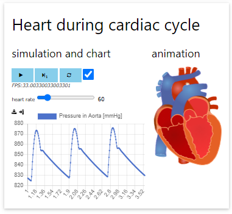
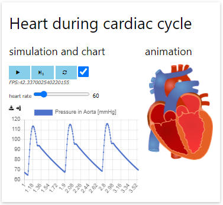

# 17. Advanced - Unit Conversion

In the previous steps we build a web simulator with chart and animation. However the chart shows the values as it comes from model - by default in SI units.

In this section we will convert the SI units to some display Unit common for pressure.

## Edit the chartjs component

Move cursor into the `<bdl-chartjs-time>` component and add attribute `convertors` into it as follows:

```markdown
<bdl-chartjs-time ...
convertors="1,133.322"></bdl-chartjs-time>
```

* The first value `1` - is numerator
* The second value `133.322` - is denominator

So the showed value is computed as

The $x$ unit is $Pa$, the $y$ unit is in $mmHg$.

## Check Chart conversion

Play the simulation by button  for couple of seconds then stop it .



Note that the values shown are between 820 and 880 mmHg, because the model is computed in normal atmospheric ambient with pressure 760 mmHg. Therefore to get physiological values we need to subtract.

## Repair conversion

Move cursor into the `<bdl-chartjs-time>` component and edit the attribute `convertors` into following value:

```markdown
<bdl-chartjs-time ...
convertors="x/133.322-760"></bdl-chartjs-time>
```

Thus current conversion is literaly expression So the showed value is computed as

## Final check

Play the simulation by button  for couple of seconds then stop it . The pressure should be among 80 and 120 mmHg.


