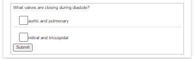
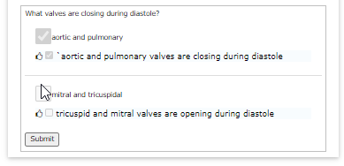

# 19. Advanced - Quiz

In this section we will create component with quiz - with multiple choice question.

## Create bdl-quiz

Within your editor, move cursor to the end of current web simulator document and click <button>bdl-quiz</button>.

Within the dialog fill the following
* question: `What valves are closing during diastole?`
* answer: `aortic and pulmonary|mitral and tricuspidal`
* correctoptions: `true|false`
* explanations: `aortic and pulmonary valves are closing during diastole| tricuspid and mitral valves are opening during diastole`

And click <button>Submit</button>. This will create a quiz component in the editor, so it should look like:
```markdown
<bdl-quiz question="What valves are closing during diastole?"
answers="aortic and pulmonary|mitral and tricuspidal"
correctoptions="true|false" 
explanations="aortic and pulmonary valves are closing during diastole| tricuspid and mitral valves are opening during diastole"
></bdl-quiz>
```

## Check quiz

You may edit the quiz component attributes directly in editor or place cursor in the `<bdl-quiz>` component and click identify/edit and you may change the attribute of the quiz in dialog.

See the quiz in preview panel.



If you check some answers and click <button>Submit</button> button, the correct answers will be displayed with explanation.


