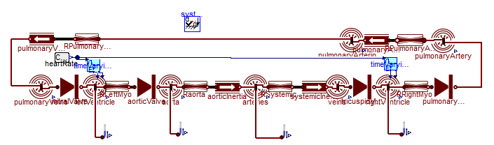

# Basic tutorial

This tutorial will guide you to transform Modelica model from Physiolibrary:

to the following web simulator:

Press buttons to start/stop/step/reset simulation:
<bdl-fmi id="idfmi" src="../model/Physiolibrary_Fluid_Examples_Fernandez2013_PulsatileCirculation.js" fminame="Physiolibrary_Fluid_Examples_Fernandez2013_PulsatileCirculation" tolerance="0.000001" starttime="0" fstepsize="0.01" guid="{a786b906-f58b-4014-8c9b-5df08bd77f4b}" valuereferences="637534370" valuelabels="aorta.pressure" inputs="id1,16777329,1,60" inputlabels="heartRate.k"></bdl-fmi>

Change the slider value. When released - it is sent to model and simulation is recalculated accordingly:
<bdl-range id="id1" title="heart rate" min="40" max="180" default="60" step="1" maxlength="2"></bdl-range>

Show some variables in chart:
<bdl-chartjs-time id="id10" width="300" height="200" fromid="idfmi" labels="Pressure in Aorta" initialdata="" refindex="0" refvalues="1"></bdl-chartjs-time>

To produce basic interactive web simulator you need these Bodylight tools: 
1. __Bodylight.js-Compiler__ - it is part of Bodylight-VirtualMachine or Docker container can be used.
2. __Bodylight-Editor__ - you may use either instance from Bodylight-VirtualMachine or static web page at https://bodylight.physiome.cz/Bodylight-Editor/
3. 

Basic guide will follow you to:

1. Compile Modelica model to FMU with source codes including solver.
2. Compile FMU to Javascript with embedded WebAssembly, this allows to run model using FMI api inside browser.
3. Create web simulator document.
4. Export web simulator document as set of deployable files to web server.

<a href='#../tutorial/basic1exportdymola.md' class="w3-button w3-theme-l1">Basic Web Simulator Tutorial - start from Dymola</a>

<a href='#../tutorial/basic2exportom.md' class="w3-button w3-theme-l1">Basic Web Simulator Tutorial - start from OpenModelica</a>
