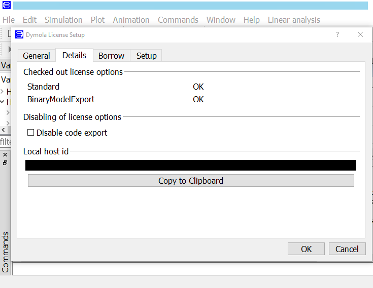
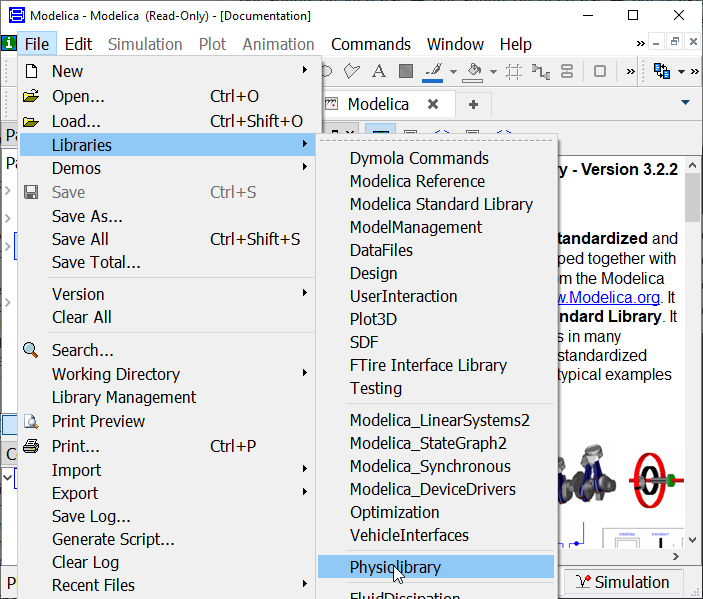
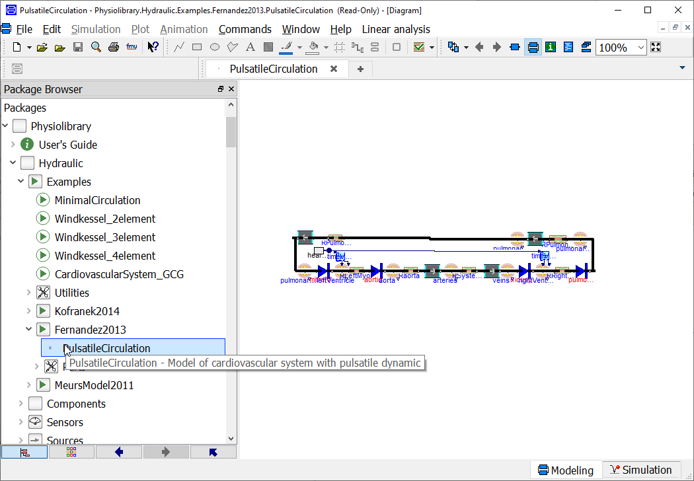
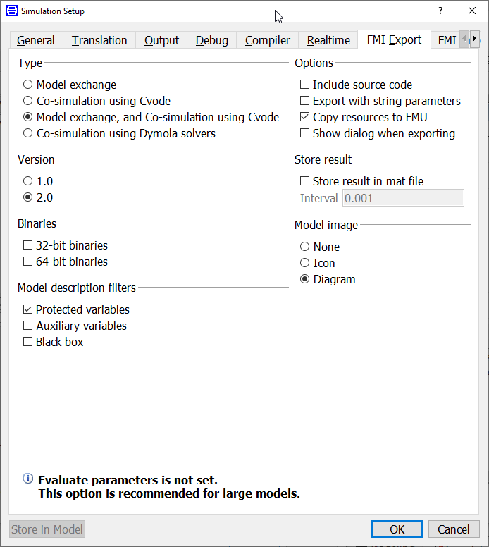
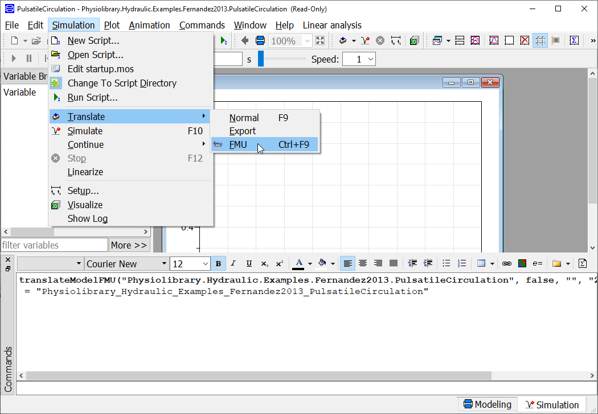
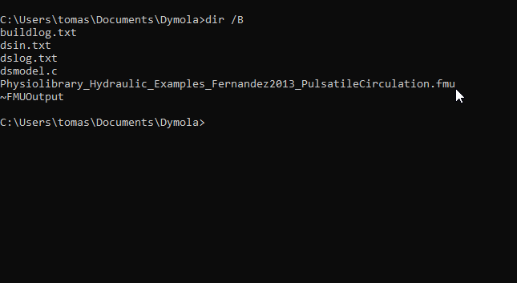

# 1. Export Model to FMU in Dymola

In this step we will export a Modelica model into FMU version 2.0 in Co-Simulation mode using Dymola tool. If you use Open Modelica tool, skip to next section.
 
## 1.1 Start Dymola tool

* Start Dymola (tested in version 2019).

## 1.2 Check License

You may need at least "Binary Mode Export" or "Source Code Generation" license in order to export FMU with source codes.

* Check appropriate license in `Help -> License -> Detail` as seen in this screenshot:

</img>

## 1.3 Open Model File

Open a Modelica model you would like to use in web simulator. 
* In this guide, we will open Physiolibrary[^1]

</img>

* and model of Hemodynamics by Fernandez de Cañete [^2] 

</img>

## 1.4 Setup FMU Export options
* Open `Simulation (tab) -> Simulation -> Setup`
* in `FMI-Export` tab check 
  * Type: `Co-Simulation with CVODE`
  * Version: `2.0`
  * Options: `Include source code`

</img>

## 1.5 Do FMU Export
  * `Simulation -> Translate -> FMU`

</img>

## 1.6 Use FMU file

Last step created a file with `.fmu` extension in current working directory.
Check it in your file system. 

</img>

Use this file in following section
