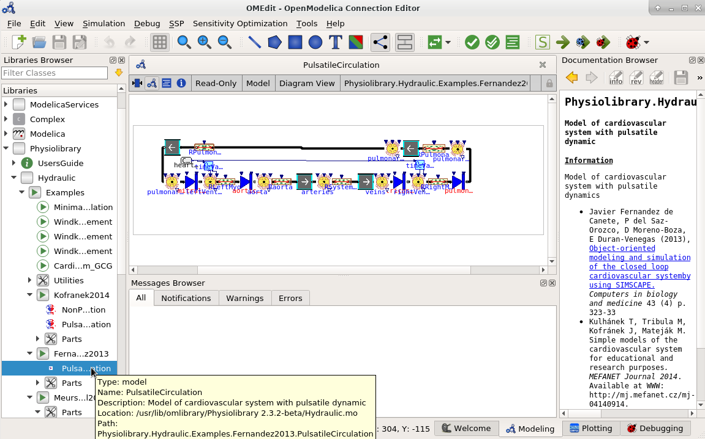
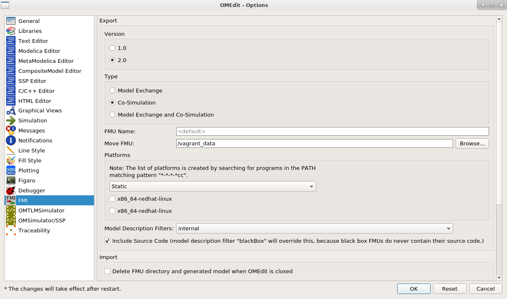
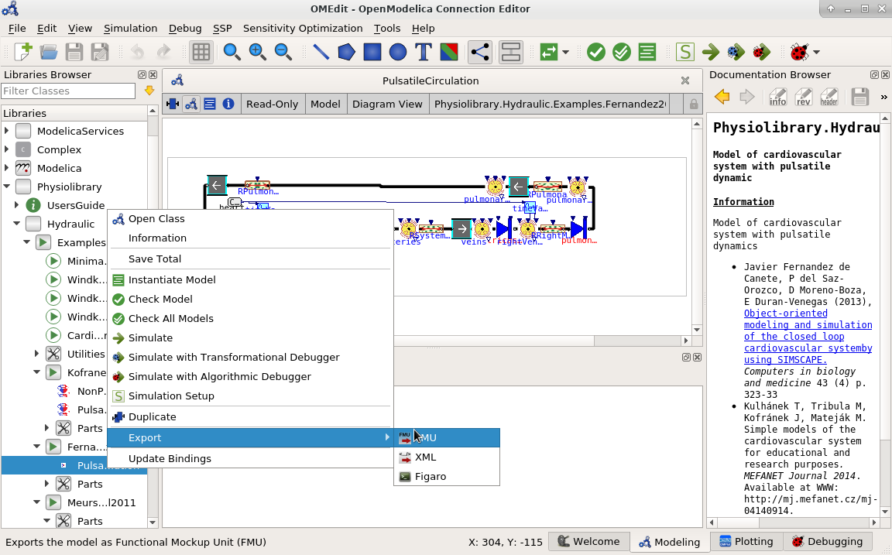
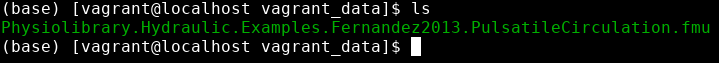

# Export Model to FMU in OpenModelica

In this step we will export a Modelica model into FMU in Co-Simulation mode using OpenModelica tool. If you use Dymola - follow previous section and skip this section.

## Start OpenModelica Editor 

* Start OMEdit (tested in version 1.16.2).

## Open Model File

Open a Modelica model you would like to use in web simulator. 
* In this guide, we will open Physiolibrary[^1] via `File -> System Libraries -> Physiolibrary

* and model of Hemodynamics by Fernandez de Cañete [^2] 

## Setup FMU Export options
* Open `Tools -> Options -> FMI`
* check these options
  * Version: `2.0`
  * Type: `Co-Simulation`
  * Move FMU: `/vagrant_data` or any other existing directory
  * Model Description Filter: `internal`
  * Include Source Code: checked <input type="checkbox" checked disabled/>

## Do FMU Export
  * right click on the selected model and select `Export -> FMU`

## Use FMU file

Last step created a file with `.fmu` extension in directory set in step 2.2 
Check it in your file system. 

And use this file in following section.

