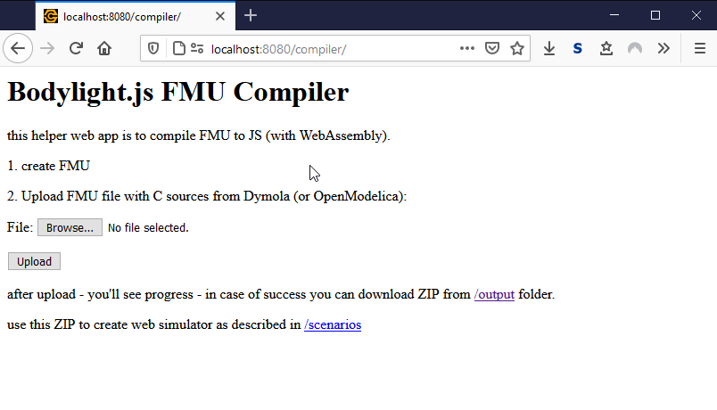
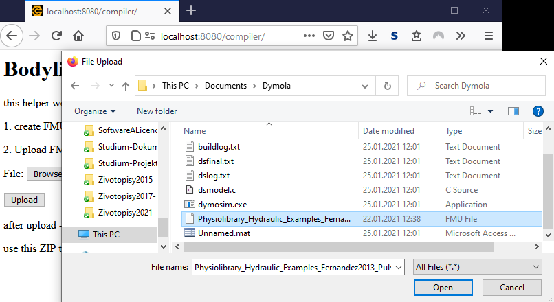
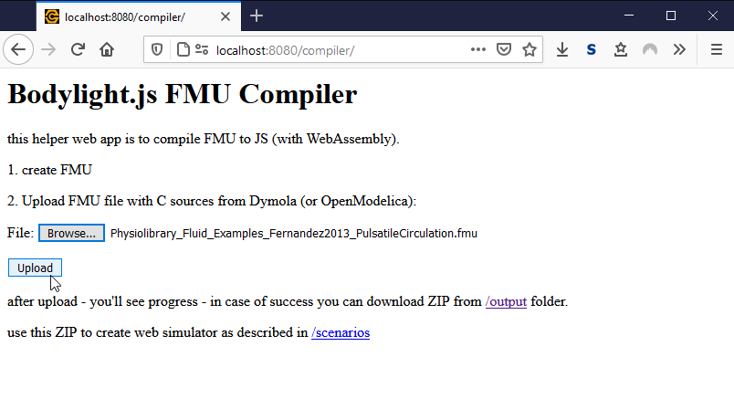
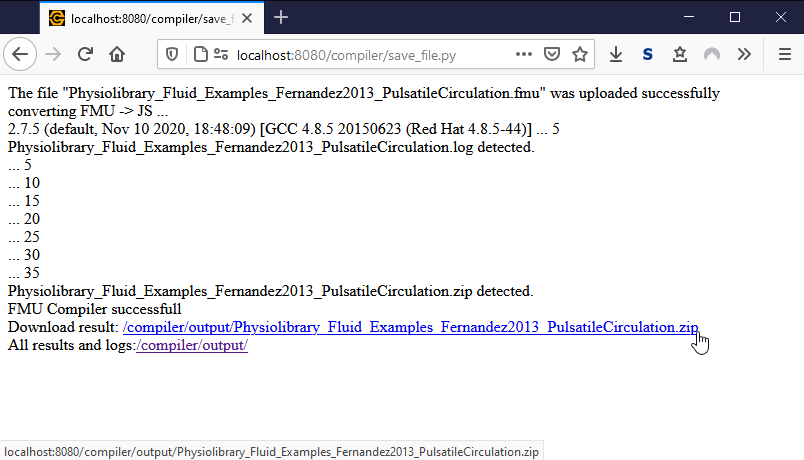

# Compile FMU to Web Assembly

We will use the produced FMU file with source codes to compile it to WebAssembly usable by modern browser supporting it via Javascript api.
As prerequisite for this step you need to have the Bodylight.JS FMU Compiler available, e.g. as part of Bodylight VirtualMachine.

## Start Bodylight Virtual Machine

If you do not have Bodylight-Virtualmachine installed, follow instruction at 
https://github.com/creative-connections/Bodylight-Virtualmachine

If Bodylight-Virtualmachine is installed then `cd` to directory where the virtual machine scripts are instaled on your machine and start the machine by `vagrant up`

```bash
cd Bodylight-Virtualmachine
vagrant up
```

## Check Compiler Web Service

The port 8080 is redirected to virtual machine web server. The compiler web service is available Bodylight VirtualMachine at the link http://localhost:8080/compiler/ Check this link and you should see this output:



## Select the FMU file

Click the <button>Browse</button> button and select for the FMU file from previous step



## Click Upload

After selecting the FMU File, click <button>Upload</button> button to start the compilation process.



## See the Compilation Process

The compilation process should produce the resulting ZIP file after 30-60s.



If the process failed consult output logs.
Otherwise proceed with the resulting ZIP file into next step. 
