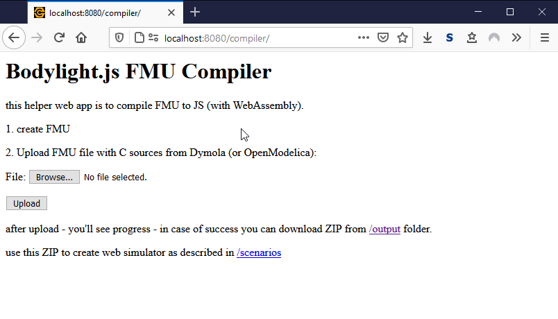
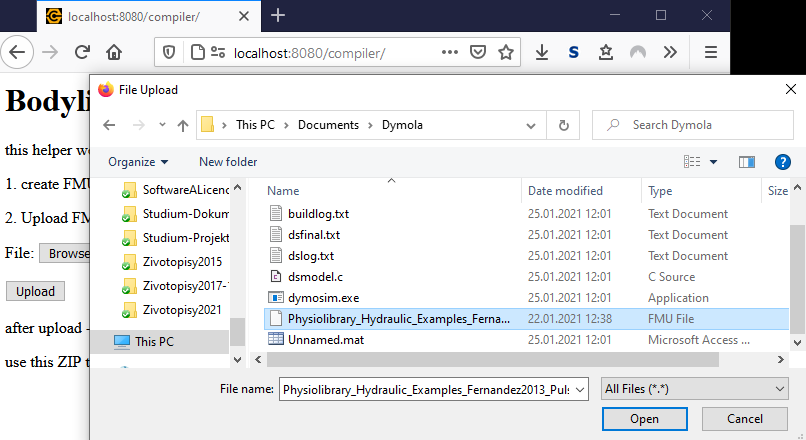
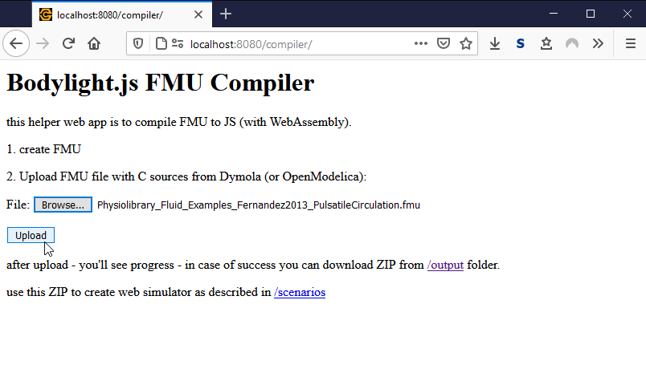
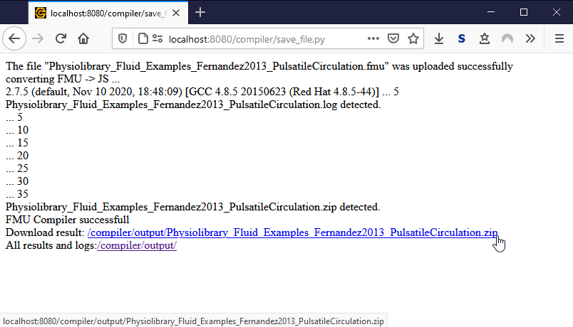

# 3. Compile FMU to Web Assembly

In this step we will compile source codes in FMU file into WebAssembly - therefore FMU can be executed by modern browsers.
You will need Bodylight.JS FMU Compiler which can be executed either in virtual machine in Oracle's VirtualBox (see Bodylight-VirtualMachine) or Docker image (see Bodylight.js-FMU-Compiler).

## Start Bodylight Virtual Machine

If you do not have Bodylight-Virtualmachine installed, install it as  instruction at 
https://github.com/creative-connections/Bodylight-Virtualmachine

After installation or if Bodylight-Virtualmachine is already installed then `cd` to directory where the virtual machine scripts are instaled on your machine and start the machine by `vagrant up`

```bash
cd Bodylight-Virtualmachine
vagrant up
```

## Check Compiler Web Service

The port 8080 is redirected by default to guest virtual machine web server at port 80. Thus access the compiler web service using host browser at http://localhost:8080/compiler/ :



## Select the FMU file

Click the <button>Browse</button> button and select the FMU file from previous step



## Click Upload

After selecting the FMU File, click <button>Upload</button> button to start the compilation process.



## See the Compilation Process

The compilation process should produce the resulting ZIP file after 30-60s.



If the process failed consult output logs.
Otherwise proceed with the resulting ZIP file into next step. 
