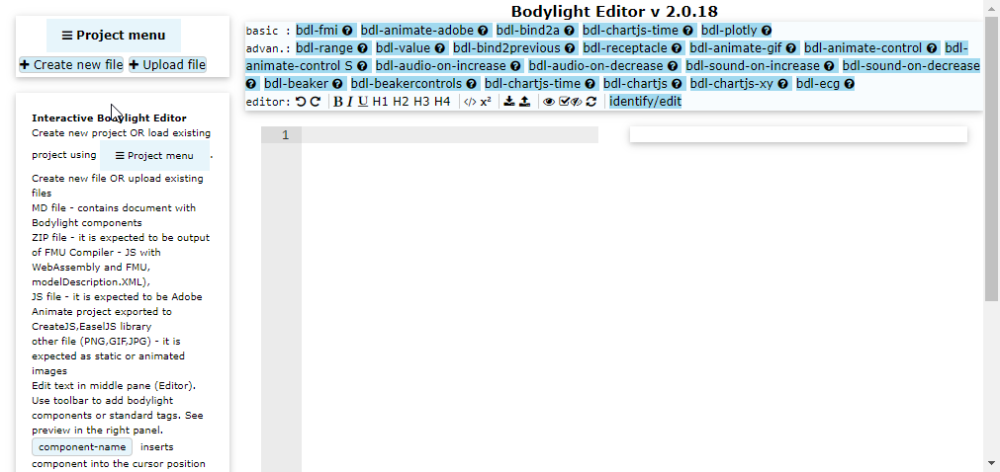

# 4. Bodylight-Editor

In this step we will create a new document in MARKDOWN syntax using Bodylight Editor which is part of the virtual-machine or is deployed as static web page.

**Static web page** means that all the project files resides in local cache of browser and is never transfered to any server. The local cache can be cleaned thus it's necesarry to save project or export project as ZIP file - it will be covered in last section of this tutorial.

We will utilize previously generated ZIP file with WebAssembly version of model simulator.

## Open Bodylight-Editor

1. either from local installation of Bodylight-VirtualMachine at http://localhost:8080/editor/
2. or from public static web page at https://bodylight.physiome.cz/Bodylight-Editor/



## Create new project

In the left menu click: `Project menu -> New project`

## Create new file

Under the left menu click button: `+ Create new file`

## Add some text in Markdown

* The [markdown-it](https://markdown-it.github.io) is used to render markdown syntax and it is enhanced with `footnote`, `highlight.js` plugins enabled.
* [katex](https://katex.org) plugin is supported to enable math in `LaTEX` syntax
* [w3-css](https://www.w3schools.com/w3css/defaulT.asp) library is included to support design.
* [bodylight-components](basic4editor.md) syntax in HTML/CSS is allowed.

A demo markdown text is prefilled in the edit panel. Clear it and add some text in Markdown as follows:

```markdown
# Introduction

Hemodynamics model simulation
```

You may see live preview while editing in right panel. Usually live preview is generated when you create a new line or delete a line.

Use icon  above to generate preview immediatelly.
