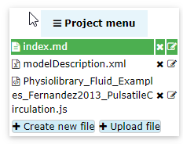
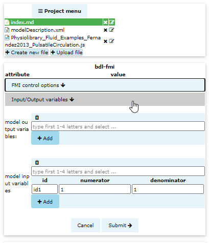
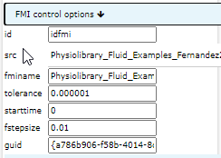

# 5. Bodylight-Editor part 2
In this step we will create a Bodylight component: `bdl-fmi` that allows control simulation interactively

## Upload ZIP file with WebAssembly 

Click <button>+ Upload file</button> and select ZIP file with FMU converted to WebAssembly generated in previous step. The ZIP file contains javascript with embedded WebAssembly code of model simulation and modelDescription.xml (compliant with FMI standard). These 2 files will appear in left panel.

## Create BDL-FMI component
Click the button <button>`bdl-fmi`</button> above. A dialog with FMI will open on the left sidebar.

## Check FMI control options

click the FMI control options <i class="fa fa-arrow-down"></i> accordion and see the simulation options. 

You may leave the default values:
* id: `idfmi` - unique id of this component, other may refer to it
* src: - javascript file of with FMU compiled into web assembly
* fminame:  - FMU model object name to be instantiated, leave the generated value
* tolerance: `0.000001` - is tolerance of solver within FMU, leave it to 1e-6
* starttime: `0` - start time of simulation
* fstepsize: `0.01` - simulation step size in seconds, to fine grainded simulation 0.01 may be enough, to increase the speed of simulation you may set the step to `0.1` second or higher.
* guid: - unique guid of object to be instantiated, leave the generated value

