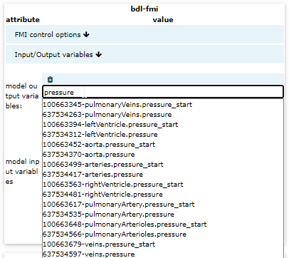
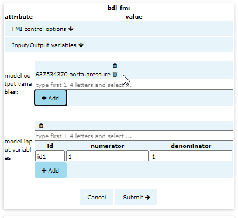
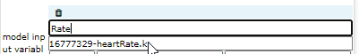
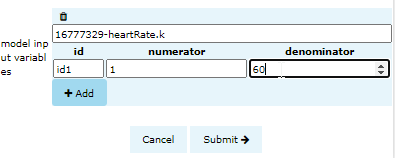
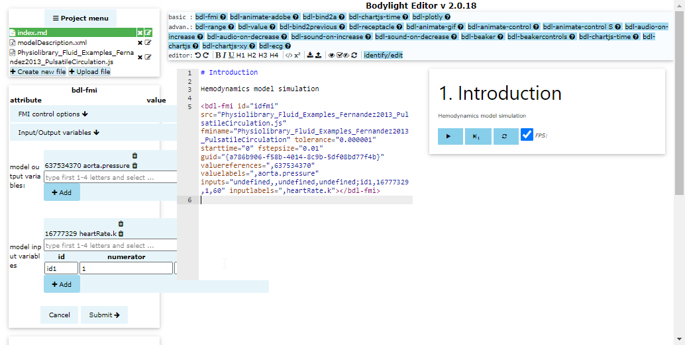

# Bodylight-Editor part 3 {num=6}

In this section we will select `output` variables which will be used to visualize and `input` variables which will be used to manipulate model parameter values.

## Output variable

Click in the `model output variables` field and fill first letters. e.g. `pressure` and the autocomplete feature will show available variables containing `pressure` substring. The number before variable name is value reference number addressing it from model.

## Select the appropriate specific variable

Click on the specific variable in autocomplete list. E.g. on `aortaPressure.pressure` and then click <button><i class="fa fa-plus"></i> Add</button>.

## Input variable

Click on the `model input variables` field and fill first letters, e.g. `Rate`. Note that autocomplete is case-sensitive. Click on the `heartRate.k` input variable.

## Input variable settings

Leave the option `id` as `id1` - this address component which will be listened for value changes.

Leave `nominator` to `1` - the value from component id1 will be multiplied by `nominator`.
Set `denominator` to `60` - the value from component id1 will be divided by `denominator`.

Thus in our case the value will be divided by 60 converting the heart rate from _per minute_ to _per second_ which is expected SI unit by the model.

Click <button><i class='fa fa-plus'></i> Add</button>.

## Submit the fmi component

Click <button>Submit</button>. 

This step adds the `bdl-fmi` component to the editor and renders control buttons to play/pause, step and reset simulation.

