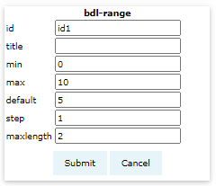
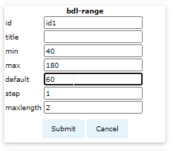

# Input component {num=7}

In this section we create input component which collect a user's input as a range slider.

## Range component

Click button <button>bdl-range</button> and a dialog will appear in left panel.

## Range options

set the following options
- id: `id1` 
  - component id referred by fmu component.
- title: `heart rate` 
  - title to be displayed
- min: `30` 
  - minimal allowed value 
- max: `180` 
  - maximal allowed value
- default: `60` 
  - default value of the range
- step: `1` 
  - user input will change current value by the step size
- maxlength: `2` 
  - length of the number dialog

## Submit the component

click the <button>Submit</button> button.

This creates a `bdl-range` component xml-tag in the editor panel - you may edit it's source code attributes. This also renders a slider in the preview panel.