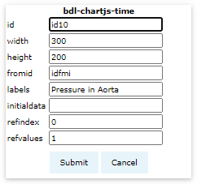
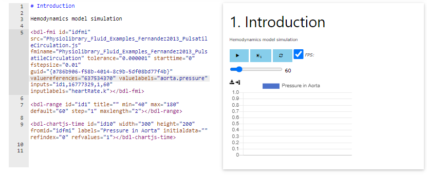
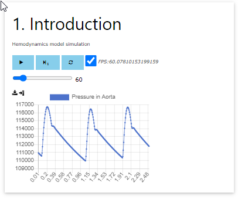

# Output and visualise variable

In this section we will create a component which will visualize a variable comming as output from fmu component.

## Chartjs-time component

click <button>bdl-chartjs-time</button>.

This will open an chartjs-time component dialog.

## Chartjs-time options

set the following options
- id: `id10` 
  - component id referred by fmu component.
- width: `300` 
  - in pixels
- height: `200` 
  - in pixels
- fromid: `idfmi` 
  - referring the id of fmu component
- labels: `Pressure in Aorta` 
  - label in chart, if more, separate by comma
- initialdata: `` 
  - some initial values to be displayed
- refindex: `0` 
  - index of variable referenced from fmu component array
- refvalues: `1`
  - number of variables to be displayed from the reference index

## Submit the component

Click <button>submit</button>.

This creates a `bdl-chartjs-time` component xml tag in the editor panel and renders a chart in the preview panel.

## Check simulation

Click the play <button><i class="fa fa-play"></i></button> to check whether simulation starts.

